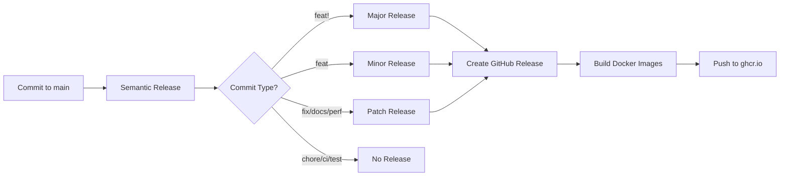

# Contributing Guide

Thank you for considering contributing to package-checker.sh! This guide will help you understand our workflow and conventions.

## 📋 Table of Contents

- [Getting Started](#getting-started)
- [Commit Message Convention](#commit-message-convention)
- [Versioning and Releases](#versioning-and-releases)
- [Development Workflow](#development-workflow)
- [Testing](#testing)
- [Pull Request Process](#pull-request-process)

## Getting Started

1. Fork the repository
2. Clone your fork:
   ```bash
   git clone https://github.com/YOUR_USERNAME/package-checker.sh.git
   cd package-checker.sh
   ```
3. Create a new branch:
   ```bash
   git checkout -b feature/your-feature-name
   ```

## Commit Message Convention

We use [Conventional Commits](https://www.conventionalcommits.org/) for commit messages. This enables automatic versioning and changelog generation.

### Commit Message Format

```
<type>(<scope>): <subject>

<body>

<footer>
```

### Types

- **feat**: A new feature (triggers MINOR version bump)
- **fix**: A bug fix (triggers PATCH version bump)
- **docs**: Documentation only changes (triggers PATCH version bump)
- **style**: Code style changes (formatting, missing semi colons, etc.)
- **refactor**: Code refactoring without changing functionality
- **perf**: Performance improvements (triggers PATCH version bump)
- **test**: Adding or updating tests
- **build**: Changes to build system or dependencies (triggers PATCH version bump)
- **ci**: Changes to CI configuration files
- **chore**: Other changes that don't modify src or test files
- **revert**: Reverts a previous commit (triggers PATCH version bump)

### Breaking Changes

Add `BREAKING CHANGE:` in the commit body or append `!` after the type to trigger a MAJOR version bump:

```
feat!: remove support for Node.js 12

BREAKING CHANGE: Node.js 12 is no longer supported
```

### Examples

**Feature (minor version bump):**
```
feat: add support for YAML vulnerability sources

Added parser for YAML-formatted vulnerability databases.
Supports both simple lists and complex structures.
```

**Bug fix (patch version bump):**
```
fix: correct version comparison for caret ranges

Fixed an issue where ^1.2.3 was not properly matching 1.3.0.
The semver comparison now correctly handles all caret range scenarios.
```

**Documentation (patch version bump):**
```
docs: update Docker usage examples

Added examples for multi-source scanning and GitHub organization scanning.
```

**Breaking change (major version bump):**
```
feat!: change --source flag behavior

BREAKING CHANGE: The --source flag now requires explicit format specification
when using remote URLs. Auto-detection is only available for local files.

Before: ./script.sh --source https://example.com/vulns.json
After: ./script.sh --source https://example.com/vulns.json --format json
```

**Multiple changes:**
```
feat: add Docker healthcheck endpoint

- Added /health endpoint for container health monitoring
- Implemented graceful shutdown handling
- Updated Dockerfile with HEALTHCHECK instruction

Closes #123
```

## Versioning and Releases

We use [Semantic Versioning](https://semver.org/) (SemVer) with automated releases.

### Version Format

```
MAJOR.MINOR.PATCH
```

- **MAJOR**: Breaking changes (e.g., 1.0.0 → 2.0.0)
- **MINOR**: New features (backward compatible) (e.g., 1.0.0 → 1.1.0)
- **PATCH**: Bug fixes and documentation (e.g., 1.0.0 → 1.0.1)

### Automated Release Process

When you push commits to the `main` branch:

1. **Semantic Release** analyzes commit messages
2. Determines the next version number based on commit types
3. Generates a changelog from commit messages
4. Creates a GitHub release with release notes
5. Tags the release (e.g., `v1.2.3`)
6. **Docker images** are automatically built and pushed with version tags

### Docker Image Tags

After a release, Docker images are tagged with:

- `vX.Y.Z` - Specific version (e.g., `v1.2.3`)
- `vX.Y` - Minor version (e.g., `v1.2`)
- `vX` - Major version (e.g., `v1`)
- `latest` - Latest stable release

Development builds from `main` branch are tagged with:
- `main` - Latest development build
- `dev` - Alias for latest development build

### Release Workflow



## Development Workflow

### 1. Make Changes

Edit the `script.sh` file or update documentation.

### 2. Test Locally

```bash
# Test with built-in feeds
./script.sh --source data/ghsa.purl

# Test with test fixtures
cd test-fixtures
../script.sh --source test-vulnerabilities.json

# Test specific functionality
./script.sh --package-name lodash --package-version 4.17.20 --source data/ghsa.purl
```

### 3. Commit with Conventional Commits

```bash
# Stage your changes
git add .

# Commit with conventional commit message
git commit -m "feat: add new feature"
```

### 4. Push to Your Fork

```bash
git push origin feature/your-feature-name
```

### 5. Create Pull Request

- Open a PR from your fork to the main repository
- Describe your changes clearly
- Reference any related issues
- Wait for review and CI checks to pass

## Testing

### Test Fixtures

Use the test fixtures in the `test-fixtures/` directory:

```bash
cd test-fixtures

# Test with JSON source
../script.sh --source test-vulnerabilities.json

# Test with CSV source
../script.sh --source test-vulnerabilities.csv

# Test with PURL source
../script.sh --source test-vulnerabilities.purl

# Test safe project (should find no vulnerabilities)
cd safe-project
../../script.sh --source ../test-vulnerabilities.json
```

### Manual Testing Checklist

Before submitting a PR, test these scenarios:

- [ ] Scanning with JSON vulnerability source
- [ ] Scanning with CSV vulnerability source
- [ ] Scanning with PURL vulnerability source
- [ ] Scanning with built-in GHSA feed
- [ ] Direct package lookup
- [ ] Version range matching
- [ ] GitHub organization scanning (if applicable)
- [ ] Multiple sources
- [ ] Configuration file usage

### Docker Testing

Test Docker images locally:

```bash
# Build full image
docker build -t package-checker:test -f Dockerfile .

# Build lightweight image
docker build -t package-checker:test-lite -f Dockerfile.lite .

# Test full image
docker run -v $(pwd)/test-fixtures:/workspace package-checker:test \
  --source /app/data/ghsa.purl

# Test lightweight image
docker run -v $(pwd)/test-fixtures:/workspace package-checker:test-lite \
  --source http://localhost:8080/vulns.json
```

## Pull Request Process

1. **Update Documentation**: If you've added features, update relevant documentation
2. **Follow Commit Convention**: Use conventional commits for your PR commits
3. **Update CHANGELOG**: Not needed - it's automatically generated from commits
4. **Describe Changes**: Provide a clear PR description with:
   - What changed
   - Why it changed
   - How to test it
5. **Wait for Review**: Maintainers will review your PR
6. **Address Feedback**: Make requested changes if needed
7. **Merge**: Once approved, your PR will be merged to main
8. **Automatic Release**: If your commit triggers a release, it will happen automatically

## PR Title Format

Use the same conventional commit format for PR titles:

```
feat: add YAML support for vulnerability sources
fix: correct semver matching for tilde ranges
docs: improve Docker usage examples
```

## Code Style

- Use **bash** for shell scripts
- Follow existing code style and patterns
- Keep lines under 100 characters when possible
- Add comments for complex logic
- Use meaningful variable names

## Adding Features

When adding new features:

1. **Check Existing Issues**: See if there's already a discussion
2. **Open an Issue**: Discuss the feature before implementing
3. **Keep it Simple**: Follow the Unix philosophy - do one thing well
4. **Document**: Add documentation for new features
5. **Test**: Add test cases in `test-fixtures/`

## Reporting Bugs

When reporting bugs:

1. **Search Existing Issues**: Check if it's already reported
2. **Provide Details**:
   - Steps to reproduce
   - Expected behavior
   - Actual behavior
   - Environment (OS, bash version, etc.)
   - Command used
   - Error messages
3. **Minimal Example**: Provide the smallest example that reproduces the bug

## Questions?

- Open an issue for questions
- Check [existing documentation](../README.md)
- Review [closed issues](https://github.com/maxgfr/package-checker.sh/issues?q=is%3Aissue+is%3Aclosed)

## License

By contributing, you agree that your contributions will be licensed under the MIT License.

---

**Thank you for contributing to package-checker.sh!** 🎉
