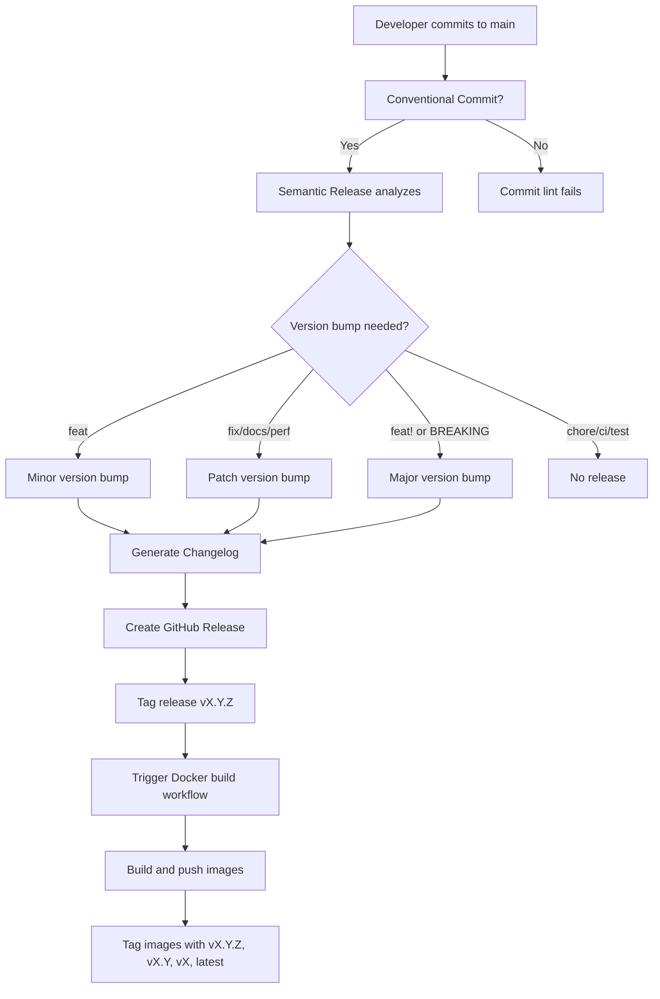

# Release Process

This document explains how releases are created and versioned for package-checker.sh.

## 🚀 Automated Releases

Releases are **fully automated** using [Semantic Release](https://semantic-release.gitbook.io/) and [Conventional Commits](https://www.conventionalcommits.org/).

### How It Works

1. **Developer commits** to the `main` branch using conventional commit messages
2. **GitHub Action** automatically:
   - Analyzes commit messages
   - Determines the next version number
   - Generates a changelog
   - Creates a GitHub release
   - Tags the release
   - Builds and pushes Docker images with version tags

### Commit Message Format

The commit message determines the version bump:

| Commit Type | Version Bump | Example |
|-------------|--------------|---------|
| `feat:` | **Minor** (0.X.0) | `feat: add YAML support` |
| `fix:` | **Patch** (0.0.X) | `fix: correct version matching` |
| `docs:` | **Patch** (0.0.X) | `docs: update examples` |
| `perf:` | **Patch** (0.0.X) | `perf: optimize parsing` |
| `feat!:` or `BREAKING CHANGE:` | **Major** (X.0.0) | `feat!: change API` |
| `chore:`, `ci:`, `test:` | **No release** | `chore: update deps` |

## 📋 Version Numbers

We follow [Semantic Versioning](https://semver.org/) (SemVer):

```
MAJOR.MINOR.PATCH
```

- **MAJOR**: Incompatible API changes (breaking changes)
- **MINOR**: New features (backward compatible)
- **PATCH**: Bug fixes and documentation (backward compatible)

### Examples

- `1.0.0` → `1.1.0`: Added a new feature (`feat:`)
- `1.1.0` → `1.1.1`: Fixed a bug (`fix:`)
- `1.1.1` → `2.0.0`: Breaking change (`feat!:`)

## 🏷️ Git Tags

Each release is tagged with:

```
v{MAJOR}.{MINOR}.{PATCH}
```

Examples: `v1.0.0`, `v1.2.3`, `v2.0.0`

## 🐳 Docker Image Tags

After a release, Docker images are tagged with:

### Full Image (`ghcr.io/maxgfr/package-checker.sh`)

- `vX.Y.Z` - Specific version (e.g., `v1.2.3`)
- `vX.Y` - Minor version (e.g., `v1.2`)
- `vX` - Major version (e.g., `v1`)
- `latest` - Latest stable release

### Lightweight Image (`ghcr.io/maxgfr/package-checker.sh-lite`)

- `vX.Y.Z` - Specific version (e.g., `v1.2.3`)
- `vX.Y` - Minor version (e.g., `v1.2`)
- `vX` - Major version (e.g., `v1`)
- `latest` - Latest stable release

### Development Images

Commits to `main` that don't trigger a release still build Docker images:

- `main` - Latest commit on main branch
- `dev` - Alias for main

## 📝 Changelog

The changelog is automatically generated from commit messages and stored in [CHANGELOG.md](../CHANGELOG.md).

### Changelog Sections

Based on commit type:

- **Features** - `feat:` commits
- **Bug Fixes** - `fix:` commits
- **Performance Improvements** - `perf:` commits
- **Documentation** - `docs:` commits
- **Code Refactoring** - `refactor:` commits
- **Build System** - `build:` commits
- **Reverts** - `revert:` commits

### Example Changelog Entry

```markdown
## [1.2.0] - 2024-01-15

### Features

- add support for YAML vulnerability sources (#123)
- implement GitHub organization scanning (#124)

### Bug Fixes

- correct version matching for caret ranges (#125)
- fix Docker image healthcheck (#126)

### Documentation

- update Docker usage examples
- add contributing guide
```

## 🔄 Release Workflow



## 🛠️ Manual Release (Emergency)

In case automated releases fail, you can manually create a release:

### 1. Update Version Manually

```bash
# Install standard-version (alternative to semantic-release)
npm install -g standard-version

# Create a new version
standard-version

# Or specify version type
standard-version --release-as minor
standard-version --release-as patch
standard-version --release-as major
```

### 2. Push Tags

```bash
git push --follow-tags origin main
```

### 3. Create GitHub Release

Go to GitHub > Releases > Draft a new release:
- Tag: `vX.Y.Z`
- Title: `vX.Y.Z`
- Description: Copy from CHANGELOG.md

### 4. Trigger Docker Build

Manually trigger the release workflow:

```bash
# Using GitHub CLI
gh workflow run release.yml
```

Or go to Actions > Release > Run workflow

## 🐛 Troubleshooting

### Release Not Created

**Symptoms**: Commits pushed but no release created

**Possible causes**:
1. Commit message doesn't follow conventional commits format
2. Only commits with no version bump (e.g., `chore:`, `ci:`)
3. Semantic Release configuration error

**Solution**:
- Check commit messages follow format: `type: description`
- Review semantic-release logs in GitHub Actions
- Ensure `.releaserc.json` is valid

### Docker Images Not Built

**Symptoms**: Release created but Docker images not pushed

**Possible causes**:
1. Release workflow failed
2. Docker build error
3. GitHub Container Registry permissions

**Solution**:
- Check Actions > Release workflow logs
- Verify Dockerfile syntax
- Ensure GITHUB_TOKEN has package write permissions

### Version Number Incorrect

**Symptoms**: Release created with wrong version number

**Possible causes**:
1. Previous release tag missing
2. Manual tag interference

**Solution**:
- Check `git tag` output for all tags
- Ensure no manual tags created
- Re-run semantic-release after fixing tags

## 📚 References

- [Semantic Release Documentation](https://semantic-release.gitbook.io/)
- [Conventional Commits Specification](https://www.conventionalcommits.org/)
- [Semantic Versioning](https://semver.org/)
- [Contributing Guide](contributing.md)

## 🔐 Security Releases

For security vulnerabilities:

1. **Do NOT** commit the fix to main immediately
2. Create a security advisory on GitHub
3. Work on fix in private fork
4. Once fix is ready:
   - Commit with: `fix(security): description`
   - Add severity to PR description
5. Release will be automated
6. Update security advisory with fix version

## 💡 Tips

- **Always** use conventional commits format
- **Test** locally before pushing to main
- **Review** the changelog after release
- **Monitor** GitHub Actions for failures
- **Update** documentation with new features

---

**Questions?** Check the [Contributing Guide](contributing.md) or open an issue.
